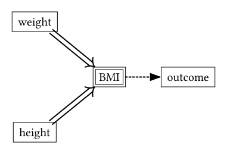
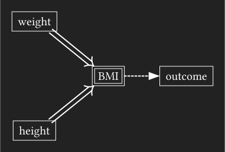
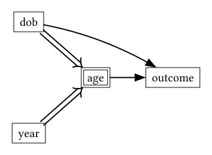
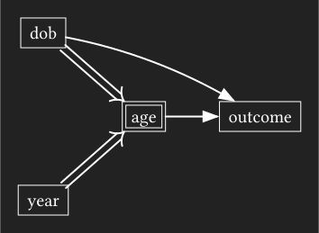

```{r}
#| code-fold: true
#| code-summary: setup
source(here::here("_defaults.R"))
library(tidyverse)
library(brms)
library(broom.mixed)
library(ggdist)
library(tidybayes)
library(marginaleffects)
library(tinytable)
library(patchwork)
library(faux)
set.seed(2025-12-8)
options(tinytable_html_mathjax = TRUE)
```

I've been thinking about Causal Inference, and have run up against a kind of confusing issue when it comes to "Composite Variables", or variables deterministically created from the combination of two or or more other variables.
I found paper talking about this from the perspective of epidemiology [@berrieDepictingDeterministicVariables2025], and one example they have is how BMI is derived from height and weight.

$$
\text{BMI} = \frac{w}{h^2}
$$

The way they suggest representing this in a dag is with a double arrow (⟹) with a dashed line leaving the derived variable.

{.light-content fig-align="center" width="50%"}

{.dark-content fig-align="center" width="50%"}

*I've* been thinking about this in terms of what I once called a "generation, lifespan, zeitgeist" model [@fruehwaldGenerationsLifespansZeitgeist2017], or what is more commonly called an "age, period, cohort" model [e.g. @rohrerThinkingClearlyAge2025].
We could really think of age as being a composite measure of date of birth and the current year.

$$
\text{age} = \text{year} - \text{dob}
$$

And in the case of language change, we're usually interested in whether or not there's generational effects, age effects, or both.

{.light-content fig-align="center" width="50%"}

{.dark-content fig-align="center" width="50%"}

In order to estimate the direct effect of $\text{dob}\rightarrow\text{outcome}$, we need to close the backdoor path $\text{dob}\rightarrow\text{age}\rightarrow\text{outcome}$.
What I haven't been sure about is whether the special deterministic effect of year on age could make it possible to use year instead, since with dob already being in the model, age and year are just linear transformations of each other.

## Simulation setup

So, I set out to simulate it.
I'll use realistic dates and ages from a multi-stage corpus, just to keep things readable.
Let's say we had a interviewers go out between 1970 and 2010 interviewing people between the ages of 15 and 90.

```{r}
expand_grid(
  year = seq(1970, 2010, by = 5),
  age  = seq(15, 90, by = 5)
) |> 
  mutate(
    dob = year - age
  ) ->
  apc_grid
```

```{r}
#| fig-width: 5
#| fig-asp: 1
#| fig-dev: png
#| crop: true
#| renderings:  
#|   - light
#|   - dark
#| code-fold: true
#| code-summary: plotting code
#| fig-align: center
apc_grid |> 
  ggplot(
    aes(dob, age)
  ) +
  geom_point() ->
  dob_age_p

apc_grid |> 
  ggplot(
    aes(dob, year)
  ) +
  geom_point() ->
  dob_year_p

((dob_age_p+coord_fixed()) / (dob_year_p + coord_fixed())) 
((dob_age_p+coord_fixed()) / (dob_year_p + coord_fixed())) & theme_darkmode()
```

For every dob & age in the grid, I'll say the estimated $\mu$ is

$$
\mu = 0.5(\text{dob}-1945) - 0.3(\text{age}-50)
$$

```{r}
apc_grid |> 
  mutate(
    mu = ((dob - 1945)  * 0.5) + ((age - 50) * -0.3)
  ) ->
  apc_mu
```

Then I'll say we have 3 speakers from each point in the grid distributed like so

$$
\mu_s \sim \mathcal{N}(\mu, 2)
$$

```{r}
apc_mu |> 
  reframe(
    .by = c(dob, age, year),
    mu = rnorm(3, mu, sd = 2)
  ) |> 
  mutate(
    speaker = row_number()
  ) ->
  apc_speakers
```

Then from each speaker, I'll sample 100 observations like so:

$$
y_i \sim \mathcal(\mu_s, 5)
$$

```{r}
apc_speakers |> 
  reframe(
    .by = c(speaker, age, year, dob),
    y = rnorm(100, mean = mu, sd = 5)
  ) ->
  dat
```

Here's how the data looks plotted against each time variable.

```{r}
#| fig-width: 9
#| fig-asp: 0.5
#| renderings:  
#|   - light
#|   - dark
#| code-fold: true
#| fig-align: center
dat |> 
  ggplot(
    aes(dob, y)
  ) +
  geom_point() ->
  dob_obs_p

dat |> 
  ggplot(
    aes(age, y)
  ) +
  geom_point() ->
  age_obs_p

dat |> 
  ggplot(
    aes(year, y)
  ) +
  geom_point() ->
  year_obs_p


dob_obs_p + age_obs_p + year_obs_p + 
  plot_layout(axes = "collect")

(dob_obs_p + age_obs_p + year_obs_p + 
  plot_layout(axes = "collect")) & theme_darkmode()
```

## DOB with and without adjustment

First things first: if we just try to estimate the effect of dob without any adjustment, it's larger than the actual effect.

```{r}
brm(
  y ~ I(dob-1945),
  data = dat,
  seed = 2025-12-8,
  backend = "cmdstanr",
  cores = 4,
  file = "mod_dob"
  #,file_refit = "always"
) ->
  mod_dob
```

```{r}
#| code-fold: true
mod_dob |> 
  tidy() |> 
  select(term:last_col()) |> 
  mutate(
    term = case_when(
      str_detect(term, "dob") ~ "dob",
      str_detect(term, "sd") ~ "$\\sigma$",
      .default = term
    )
  ) |> 
  tt() |> 
  format_tt(
    digits = 2
  ) |> 
  style_tt(
    i = 2,
    bold = T
  )
```

Now, if we adjust for age, the dob effect is more accurately estimated

```{r}
brm(
  y ~ I(dob-1945) + I(age-50),
  data = dat,
  seed = 2025-12-8,
  backend = "cmdstanr",
  cores = 4,
  file = "mod_age"
  #,file_refit = "always"
) ->
  mod_dob_age
```

```{r}
#| code-fold: true
mod_dob_age |> 
  tidy() |> 
  select(term:last_col()) |> 
  mutate(
    term = case_when(
      str_detect(term, "dob") ~ "dob",
      str_detect(term, "age") ~ "age",
      str_detect(term, "sd") ~ "$\\sigma$",
      .default = term
    )
  ) |> 
  tt() |> 
  format_tt(
    digits = 2
  ) |> 
  style_tt(
    i = 2,
    bold = T
  )
```

## Alternative adjustment attempts

Like I said above, given dob, age and year are linear transformations of each other, so I wondered if it was possible to use year as an alternative adjustment variable.
Turns out, *kinda*, but it's not as straightforward.

```{r}
brm(
  y ~ I(dob-1945) + I(year-1995),
  data = dat,
  seed = 2025-12-8,
  backend = "cmdstanr",
  cores = 4,
  file = "mod_dob_year"
  #,file_refit = "always"
) ->
  mod_dob_year
```

```{r}
#| code-fold: true
mod_dob_year |> 
  tidy() |> 
  select(term:last_col()) |> 
  mutate(
    term = case_when(
      str_detect(term, "dob") ~ "dob",
      str_detect(term, "year") ~ "year",
      str_detect(term, "sd") ~ "$\\sigma$",
      .default = term
    )
  ) |> 
  tt() |> 
  format_tt(
    digits = 2
  ) |> 
  style_tt(
    i = 2,
    bold = T
  )
```

The estimated year effect is the same as the estimated age effect in the `dob + age` model, but the dob effect is biased in the same way as the `dob` alone model!
I was scratching my head on this one until I plotted out the relationship between dob and $\mu$ controlling for year vs age.

```{r}
#| code-fold: true
#| fig-width: 10
#| fig-asp: 0.5
#| renderings: 
#|   - light
#|   - dark
apc_mu |> 
  filter(
    age == min(age) | age == max(age) |
      year == min(year) | year == max(year)
  ) |> 
  ggplot(
    aes(dob, mu)
  ) + 
  geom_point() +
  geom_line(
    aes(group = age, color = age)
  ) +
  scale_x_continuous(breaks = seq(1900, 2000, by = 50))->
  dob_mu_age

apc_mu |> 
  filter(
    age == min(age) | age == max(age) |
      year == min(year) | year == max(year)
  ) |>   
  ggplot(
    aes(dob, mu)
  ) + 
  geom_point() +
  geom_line(
    aes(group = year, color = year)
  )+
  scale_x_continuous(breaks = seq(1900, 2000, by = 50))->
  dob_mu_year

(
  dob_mu_age + dob_mu_year + 
  plot_layout(axes = "collect")
) & theme_sub_legend(position = "top", text = element_blank())

(
  dob_mu_age + dob_mu_year + 
  plot_layout(axes = "collect")
) & theme_darkmode() + theme_sub_legend(position = "top", text = element_blank())
```

Choosing between holding age and year constant is effectively choosing between one of the sets of adjacent sides in the parallelogram above.
When holding age constant, the slope across dob is shallower (and correct), while when holding year constant the slope across dob is steeper.
The reason year and age have the same estimated effect is because the spacing between the lines in the right and left panels are the same.

*But*!
I *can* get an estimate of dob across age from the posterior of the `dob + year` model.
First, I'll create a prediction grid where dob shifts by 1, and age is held constant.

```{r}
tibble(
  dob = c(1945, 1946),
  age = 50
) |> 
  mutate(
    year = dob + age
  ) ->
  pred_grid
```

Then, I'll get the predicted values, and calculate the difference across dob in the posterior.

```{r}
mod_dob_year |> 
  predictions(
    newdata = pred_grid
  ) |> 
  posterior_draws() |> 
  summarise(
    .by = drawid,
    diff = diff(draw)
  ) |> 
  mean_hdci(diff) |> 
  select(diff:.upper)
```

This is the same estimated effect (and credible interval) as the `dob + age` model.

### Using a random effect?

One more thing I wanted to see was whether adding a random intercept by speaker would adjust things at all.
Age *is* a property of each speaker, and we sometimes talk about the importance of random effects to account for unknown or unmodelable properties of the group-level factor.

```{r}
brm(
  y ~ I(dob-1945) + (1|speaker),
  data = dat,
  seed = 2025-12-8,
  backend = "cmdstanr",
  cores = 4,
  file = "mod_dob_ranef"
  #,file_refit = "always"
) ->
  mod_dob_ranef
```

```{r}
#| code-fold: true
mod_dob_ranef |> 
  tidy() |> 
  select(group:conf.high) |> 
  mutate(
    term = case_when(
      str_detect(term, "dob") ~ "dob",
      group == "speaker" ~ "$\\sigma_s$",
      group == "Residual" ~ "$\\sigma$",
      .default = term
    )
  ) |> 
  tt() |> 
  format_tt(
    replace = "",
    digits = 2
  ) |> 
  style_tt(
    i = 2,
    bold = T
  )
```

The result is: nope.
It looks like the speaker level variance has been overestimated (it was actually $\sigma_s = 2$), and the uncertainty around the dob estimate is a little wider, but it's not an effective adjustment approach.

### Using speaker as a *fixed* effect?

This will result in a monstrously large set of parameters, but I also wanted to see what would happen if I included speaker as a fixed effect.
I don't know *why* this would be any different, but I'll try it anyway.
In order to get this model to fit in a reasonable time, I've subsetted it down to one speaker per age/dob combo, and set a fairly informative prior on the betas.

```{r}
dat |> 
  filter(
    .by = c(age, dob),
    speaker == first(speaker)
  ) |> 
  mutate(
    speaker = factor(speaker) |> 
      faux::contr_code_sum()
  )->
  dat_sub
```

```{r}
brm(
  y ~ I(dob-1945) + speaker,
  data = dat_sub,
  seed = 2025-12-8,
  backend = "cmdstanr",
  prior = c(prior(normal(0, 10), class = b)),
  cores = 4,
  file = "mod_dob_speaker"
  #,file_refit = "always"
) ->
  mod_dob_speaker
```

```{r}
#| code-fold: true
mod_dob_speaker |> 
  tidy() |> 
  select(term:conf.high) |> 
  filter(
    str_detect(term, "speaker", negate = T)
  ) |>
  mutate(
    term = case_when(
      str_detect(term, "dob") ~ "dob",
      str_detect(term, "sd") ~ "$\\sigma$",
      .default = term
    )
  ) |> 
  tt(
    notes = "`speaker` effects excluded"
  ) |> 
  format_tt(
    digits = 2
  ) |> 
  style_tt(
    i = 2,
    bold = T
  )
```

Still no.

## The upshot

I guess the special thing about a deterministic relationship like $\begin{array}{c}\text{dob}\\\text{year}\end{array}\Rightarrow\text{age}$ is that you can estimate something like $E[Y^{dob=1}-Y^{dob=0}|  \text{age}]$ from the posterior of a model like `dob + year`.
But the default effect estimated from such a model isn't directly interpretable as if age had been controlled for.
