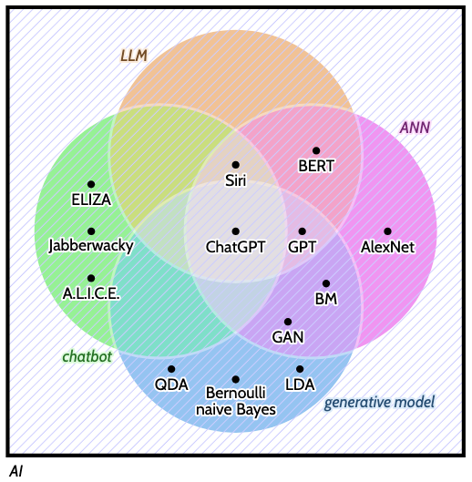

```{r}
#| echo: false
total <- 93 + 44 + 33 + 67 + 1 + 6 + 10 + 6 + 3 + 10 + 8 + 15
```

I've spent a lot of professional time on (and, perhaps, built a reputation for) research tool building ([fasttrackpy](https://fasttrackiverse.github.io/fasttrackpy/), [aligned-textgrid](https://forced-alignment-and-vowel-extraction.github.io/alignedTextGrid/), [new-fave](https://forced-alignment-and-vowel-extraction.github.io/new-fave/), [densityarea](https://jofrhwld.github.io/densityarea/), [tidynorm](https://jofrhwld.github.io/tidynorm/)).
For the most part, these are tools that *I* wanted to improve my research workflow, and I've tried to make them available and approachable to others as well.
Adding together all of the pages of documentation and tutorials I've written for just the tools I linked here comes out to `{r} total`.

So, I am fairly invested in working on and using tools that make research life easier, faster, and more reproducible, which is why the discussion surrounding a recent Substack post titled *Academics Need to Wake Up on AI* caught my attention.
I'm not linking to it, or even attributing it to the named author, because it had the following postscript:

> *P.S. This post was entirely generated and posted on Substack by agentic AI using my new Claude Code (Opus 4.6) workflow. Make of that what you will.*

However it did link to an X post by an actual person about AI refusal in research that said:

> Put another way, I get the desire for artisanal, hand-crafted research, with the matrices hand-inverted.
> But our job is to move the frontier of knowledge, not self-actualization.
> [*-Kevin A. Bryan on X*](https://x.com/Afinetheorem/status/2022334133842919681)

Sometimes people have expressed hesitation about using the tools *I've* built, and maybe they might imagine me saying something like this.
But I think both why and how I'd promote use of research automation tools is *very* different.

# What are we actually talking about?

As @guestUncriticalAdoptionAI2025 point out, talking about the use of "AI" in research is almost too nebulous to be useful since it's a label applied to incomparable models and methods.

{fig-align="center"}

The tools the Substack and X post are talking about, specifically, are Large Language Models with tooling around them that feeds them content from disc or a web crawl as input, and executes code that that they generate (sometimes called AI Agents).
And the promoted use case is using these AI Agents to generate and execute entire bodies of analysis code, and then to generate a write up of the results.

When people object to the use of "AI" (in this sense), its promoters will sometimes pull a rhetorical trick by pointing to different denotations of "AI" as successes.
For example, good old-fashioned machine vision models have been successful in disease screening (even if they might deskill the physicians that use them [@budzynEndoscopistDeskillingRisk2025]).
That is not the denotation of AI under discussion.

## What's so wrong about using LLMs this way?

Others have already touched on issues with this use of LLMs.
Completely setting aside the problems of reliability and reproducibility [@DefeatingNondeterminismLLM], it spawns from a flawed paradigm where the purpose of science is to produce papers, and the more papers that are produced, the more science has been done.
The greater the papers, the greater the scientist, the more prestigious and lucrative their employment.
Under this paradigm, making the paper generating machine go whirrr makes perfect sense.
It's not a paradigm where any human understanding, whether individual researchers or the research community, really matters.

It should be noted this paradigm existed long before LLMs became widely available.
People have been slicing their research up into [minimum publishable units](https://en.wikipedia.org/wiki/Least_publishable_unit) for a long time.

## There *are* use cases for LLMs

Just to be clear that I'm not opposed to LLM utilization across the board, I think there *are* some clear and clever use cases for them.
For example, if you are running a self-paced reading experiment and you want to control for the [cloze probability](https://en.wikipedia.org/wiki/Cloze_test) at a target word, what better estimator of next-token probability is there than an LLM?
It means you'd need to interact with it programatically, specifically with the logits it returns across the vocabulary, which is *not* the typical interface.
But it's a use case!
Similarly, the [whisper](https://github.com/openai/whisper) speech-to-text model is an LLM even if it's not usually discussed that way.

# Not all automation is the same

I, myself, have written and used tools that automate some research processes.
[Matrices even get inverted](https://github.com/Forced-Alignment-and-Vowel-Extraction/new-fave/blob/30d57d2528dbaf7840b2e5f16f156adbbee38342/src/new_fave/measurements/calcs.py#L97-L123).
new-fave, in particular, comes after a long history of automating and streamlining spectrographic vowel analysis.
Initially every vowel spectrogram was printed to paper, and the frequencies measured by ruler.
In reporting their inter-annotator reliability tests, @lys say

> Figures are given below for mean absolute differences between measurers in fortieths of an inch \[1/40\].

Since then, spectrographic analysis was computerized using Linear Predictive Coding, first implemented on dedicated machines, then in expensive proprietary software, then in [free and open source software](https://praat.org/).
Tools like FAVE, fasttrack, and new-fave remove the necessity for researchers to ponder over every individual vowel, which substantially speeds up the research process.

So how can I build and promote the use of *these* automation tools while criticizing the use & promotion of LLM agents?

## Human oriented automation

First and foremost, the goal of the tools I've built has been to help researchers get to the understanding and inference stage of their work quicker.
There was a pre-existing approach to spectrographic vowel analysis which relied on a substantial amount of data to work, and the process of hand adjusting the LPC parameters token-by-token to collect that data was, itself, not particularly informative.
That is the kind of circumstance that is ripe for automation that does not, in any way, circumvent the process or struggle of researchers to understand the nature of the data they've collected.
One thing I've found, in fact, is collecting more data in less time results in all new kinds of research questions to struggle to understand.[^1]
There's no sense in which these tools deliver completed inference and analysis.

[^1]: As Andrew Gelman once said, "[N is never large.](https://statmodeling.stat.columbia.edu/2005/07/31/n_is_never_larg/)"

## Research community oriented promotion

Let me tell you this: you'll never catch me writing a blog post titled "Sociolinguists need to wake up on new-fave." And if someone told me they didn't want or like to use it, I'd never respond by telling them they have a misplaced attention on their personal self-actualization.
I *do* think I've developed some useful tools, which is why I've written nearly 300 pages of documentation and tutorials to try to help bring people on board who have an interest.
And I've more than once stood over someone's laptop at a conference to help them debug an issue they were having.

If the people promoting AI agents think they're so great, and have respect for the people in their field, they should put their tokens where their mouth is and generate up some accessible tutorials for how to set them up.
[Here's an example of what that might look like](https://emilhvitfeldt.com/post/claude-code-alt-text-quarto/).
Otherwise, all of this talk is really just good old fashioned intellectual posturing about how much more clever they are than their critics.

# Different kinds of understanding

I think there's one more, really important point to be made that as useful as I think the research tools I've built are, automation is not the right approach for every project.
Like I said above, there was a pre-existing research paradigm with its own questions to be answered and methods for addressing them that automation facilitates.

But, there have always been other phonetic research paradigms where poring over individual tokens' spectrograms is the research *method*.
For example, @Temple2009 explores detailed coarticulatory effects and phonetic variation through the presentation of key examples.
Research done this way are not vanity projects of "self-actualization." There are simply different scopes of inquiry, and a close, manual analysis of individual examples contributes to our understanding of language in a different way.
The existence of automation for other kinds of research methods doesn't supersede these research questions, and it's not a waste of time to pursue them.
