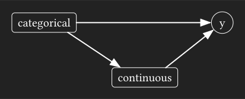
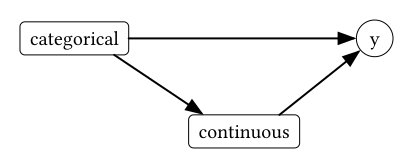
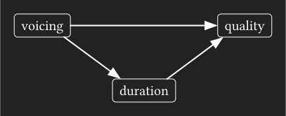
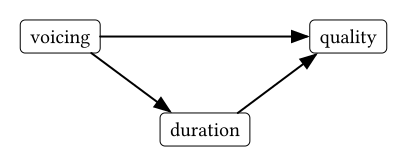
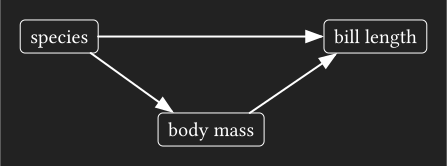
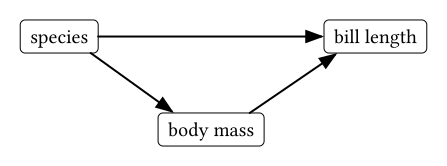

```{r}
#| echo: false
#| eval: false
setwd(here::here())
source(here::here(".Rprofile"))
```

```{r}
#| message: false
#| code-fold: true
#| code-summary: Setup
library(tidyverse)
library(broom)
library(marginaleffects)
library(ggdag)
library(dagitty)
library(ggdist)
library(geomtextpath)
library(tinytable)
source(here::here("_defaults.R"))

options(
  tinytable_tt_digits = 3
)
```

I've been noodling over things related to causal inference for a bit now, like DAGs, adjustment sets, marginal effect etc.
One thing I hadn't fully appreciated before is how your choice to estimate direct effects will make your model *predictions* very sensitive to the kind of prediction grid you use.
The rest of this post is just me working through these complications step-by-step.

# The kind of DAG

A relatively common kind of causal DAG that (implicitly) comes up in linguistics involves some kind of categorical predictor that has an effect on another continuous predictor.

{.dark-content width="80%"} {.light-content width="80%"}

For example:

-   following consonant voicing has an effect on vowel duration
-   vowel duration has an effect on vowel quality
-   following consonant voicing also has an effect on vowel quality

{.dark-content width="80%"} {.light-content width="80%"}

With causal relationships like this, people often ask something like

> Is there *really* an effect of consonant voicing on vowel quality, or is there just an effect of vowel duration?

This is a question about the *direct effect* of voicing on vowel quality.
If we set up the dag and check what adjustment variables we need to include to estimate the direct effect of voicing, we'll see that we need to include duration in the model.

```{r}
voicing_dag <- ggdag::dagify(
  quality ~ voicing + duration,
  duration ~ voicing
)

dagitty::adjustmentSets(
  voicing_dag, 
  outcome = "quality",
  exposure = "voicing",
  effect = "direct"
) 
```

But, if we wanted to estimate the *total* effect of voicing on vowel quality, we shouldn't include duration.

```{r}
dagitty::adjustmentSets(
  voicing_dag, 
  outcome = "quality",
  exposure = "voicing",
  effect = "total"
) 
```

This difference between direct and total effects feels a bit abstract sometimes.
I'm going to walk through a little example using the `penguins` dataset, with a focus for how we should approach getting model predictions.

# Data setup

The causal relationships I'll look at in the `penguins` data set are:

-   species has an effect on body mass
-   body mass has an effect on bill length
-   species also has an effect on bill length

{.dark-content width="80%"} {.light-content width="80%"}

If we look at the effect of species on both bill length and body mass, we can see a clear effect for both:

```{r}
#| fig-width: 7
#| fig-height: 4
#| fig-align: center
#| code-fold: true
#| code-summary: Plotting code
#| renderings: 
#|   - light
#|   - dark
penguins |>
  select(
    species, body_mass, bill_len
  ) |>
    drop_na() |>
    pivot_longer(
      body_mass:bill_len,
      names_to = "measure"
    ) |>
    ggplot(
      aes(species, value)
    )+
      stat_dots(
        side = "both"
      ) +
      facet_wrap(
        ~measure,
        scales = "free_y"
      ) +
      labs(y = NULL) -> p

p
p+theme_darkmode()
    
```

And if we look at the effect of body mass on bill length, we can see another very clear effect.


```{r}
#| fig-width: 5
#| fig-height: 4
#| fig-align: center
#| code-fold: true
#| code-summary: Plotting code
#| renderings: 
#|   - light
#|   - dark
penguins |> 
  ggplot(
    aes(body_mass, bill_len, color = species)
  ) + 
    geom_point() +
    guides(
      color = "none"
    )-> p

p + 
 stat_ellipse(
  geom = "labelpath",
  aes(label = species),
  hjust = 0,
  label.padding = 0.01,
  show.legend = F  
) 

p  + 
 stat_ellipse(
  geom = "labelpath",
  aes(label = species),
  hjust = 0,
  label.padding = 0.01,
  fill = plot_bg,
  show.legend = F
) + 
  theme_darkmode()
```

Let's, really quick, get the mean and standard error of bill length by species.

```{r}
penguins |>
  drop_na(starts_with("bill_")) ->
  penguin_full

penguin_full|>
  summarise(
    .by = species,
    estimate = mean(bill_len),
    sd = sd(bill_len),
    n = n()
  ) |> 
  mutate(
    se = sd / (sqrt(n)),
    conf.low = estimate - (1.96*se),
    conf.high = estimate + (1.96*se),
    method = "mean"
  ) ->
  mean_est
```

```{r}
#| code-fold: true
#| code-summary: table_code
mean_est |>
  select(species, estimate, conf.low, conf.high) |>
  tt()
```

I'll call these quantities $\bar{Y}$ with a superscript for each species.

$$
\begin{aligned}
\bar{Y}^a\\
\bar{Y}^c\\
\bar{Y}^g
\end{aligned}
$$

Here they are plotted over the data:

```{r}
#| code-fold: true
#| code-summary: Plotting code
#| fig-width: 5
#| fig-height: 4
#| fig-align: center
#| renderings: 
#|   - light
#|   - dark
mean_est |>
  ggplot(
    aes(species, estimate)
  ) + 
    geom_dots(
      data = penguin_full,
      aes(x = species, y = bill_len),
      side = "both"
    ) +    
    geom_pointinterval(
      size = 5, 
      aes(
        ymin = conf.low,
        ymax = conf.high,
        color = method
      )
    ) ->
  p

p
p+theme_darkmode()
```

One way to estimate the effect of species on bill length would be to subtract these means from eachother.

$$
\begin{aligned}
\bar{Y}^c - \bar{Y}^a\\
\bar{Y}^g - \bar{Y}^a
\end{aligned}
$$

```{r}
#| code-fold: true
#| code-summary: Table code
mean_est |>
  select(
    species,
    estimate
  ) |>
  pivot_wider(
    names_from = species,
    values_from = estimate
  ) |>
  mutate(
    Chinstrap - Adelie,
    Gentoo - Adelie
  )|>
  select(
    matches("-")
  ) |>
  pivot_longer(
    everything(),
    names_to = "contrast",
    values_to = "estimate"
  ) |>
  mutate(method = "mean") ->
  mean_comparisons

mean_comparisons |> 
  select(-method) |> 
  tt()
```

If we look at these differences in means, and consider the scatterplot of body mass vs bill length, we might wonder whether the difference between Gentoo and Adelie is really that large.
Maybe Gentoo penguins are just larger overall, with proportionally longer bills.
That's where estimating the direct effect comes in.

# Fitting a model

A simple linear model will do the trick:

```{r}
bill_model <- lm(
  bill_len ~ body_mass + species, 
  data = penguin_full
)
```

And if we look at the estimated effect of species:

```{r}
#| code-fold: true
#| code-summary: Table code

tidy(
  bill_model
) |> 
  filter(
    str_detect(
      term, "species"
    )
  ) |>
  select(term, estimate) |>
  tt()
```

The estimated difference between Gentoo and Adelie is, in fact, about half as much as the comparison of means suggested.

# Getting Predictions

Here's where things start getting a little tricky, and we need to take some care in how we get and think about predicted values.

## Average Predictions

The function `avg_predictions()` will calculate the predicted unit level bill length, then average over species.
Here, $S$ stands for the species variable, and $M$ stands form the body mass variable.

$$
\begin{aligned}
E[Y_i^a | S=a, M_i]\\
E[Y_i^c | S=c, M_i]\\
E[Y_i^g | S=g, M_i]\\
\end{aligned}
$$

```{r}
avg_predictions(
  bill_model,
  by = "species"
) |>
  mutate(method = "pred_avg") ->
  avg_pred
```

```{r}
#| code-fold: true
#| code-summary: Table code
avg_pred |> 
  select(
    species, 
    estimate,
    conf.low,
    conf.high
  ) |> 
    tt()
```

We can visually compare these average predictions to the mean and standard errors we estimated above:

```{r}
#| code-fold: true
#| code-summary: Plotting code
#| fig-width: 5
#| fig-height: 4
#| fig-align: center
#| renderings: 
#|   - light
#|   - dark
bind_rows(
  mean_est,
  avg_pred
) |>
  ggplot(
    aes(species, estimate)
  ) + 
    geom_dots(
      data = penguin_full,
      aes(x = species, y = bill_len),
      side = "both"
    ) +    
    geom_pointinterval(
      size = 5, 
      aes(
        ymin = conf.low,
        ymax = conf.high,
        color = method
      ),
      position = position_dodge(width = 0.2)
    ) ->
   p

p
p+theme_darkmode()
```

## Predictions at representative values

To get predictions at representative values, [we can use the `datagrid()` function](https://lingmethodshub.github.io/content/R/using-marginal-effects/#using-prediction-grids).
If we just pass the model to `datagrid()` and no other arguments, it will give us back a 1 row data frame where every column is either the average value across the original data, or the most frequent level.

```{r}
datagrid(
  model = bill_model
) |> 
  tt()
```

To get a prediction for each species, I'll pass a vector of species names to `species`.

```{r}
datagrid(
  model = bill_model,
  species = c(
    "Adelie",
    "Chinstrap",
    "Gentoo"
  )
) -> 
  grid1

grid1 |>
  tt() 
```

We can describe the predictions we get as the expected bill length for each species, conditional on the average body mass.

$$
\begin{aligned}
  E[Y^a | S=a, \bar{M}] \\
  E[Y^c | S=c, \bar{M}] \\  
  E[Y^g | S=g, \bar{M}]
\end{aligned}
$$

```{r}
predictions(
  bill_model,
  newdata = grid1
) |> 
  mutate(method = "pred_grid1")->
  species_pred
```

If we compare these predicted values to the previous estimates, they're *very* different!

```{r}
#| code-fold: true
#| code-summary: Plotting code
#| fig-width: 5
#| fig-height: 4
#| fig-align: center
#| renderings: 
#|   - light
#|   - dark
bind_rows(
  mean_est,
  avg_pred,
  species_pred
) |> 
 ggplot(
    aes(species, estimate)
  ) + 
    geom_dots(
      data = penguin_full,
      aes(x = species, y = bill_len),
      side = "both"
    ) +    
    geom_pointinterval(
      size = 5, 
      aes(
        ymin = conf.low,
        ymax = conf.high,
        color = method
      ),
      position = position_dodge(width = 0.3)
    ) -> 
    p

p
p + theme_darkmode()
```

The predicted bill length for each species, especially Gentoo, don't look like *typical* bill lengths for each species.
But that's because these predictions were conditional on the average body mass across all individuals, which isn't a representative body mass for any individual species.

```{r}
#| code-fold: true
#| code-summary: Plotting code
#| fig-width: 5
#| fig-height: 4
#| fig-align: center
#| renderings: 
#|   - light
#|   - dark


bill_model |>
  predictions(
    newdata = datagrid(
      species = unique,
      body_mass = range
    )
  )->
    full_est

bolden <- \(x){
  str_glue("<b>{x}</b>")
}

penguin_full |> 
  ggplot(
    aes(body_mass, bill_len, color = species)
  ) + 
    geom_point(
      size = 0.2,
      alpha = 0.5
    ) + 
    geom_textline(
      data = full_est,
      aes(x = body_mass, y = estimate, label = bolden(species)),
      hjust= 0.7,
      rich = T
    )+
    geom_vline(
      xintercept = mean(penguin_full$body_mass)
    ) +
    geom_point(
      data = species_pred,
      aes(y = estimate)
    ) +
    guides(
      color = "none"
    ) -> p

p
p + theme_darkmode()

```

## Another prediction grid

Instead of setting `body_mass` to the mean across all penguins, let's instead set it to the mean within each species.
We can do that with `datagrid()` by passing it `by = "species"`.

```{r}
datagrid(
  model = bill_model,
  by = "species"
) ->
  grid2
  
grid2 |> 
  tt()
```

Using this prediction grid, we could describe the predictions as:

$$
\begin{aligned}
  E[Y^a | S=a, \bar{M}^a] \\
  E[Y^c | S=c, \bar{M}^c] \\  
  E[Y^g | S=g, \bar{M}^g]
\end{aligned}
$$

```{r}
predictions(
  bill_model,
  newdata = grid2
) |> 
  mutate(
    method = "pred_grid2"
  )->
  typical_pred
```

Comparing these predictions to estimates we had before, we can see they're more in-line with what we expect the typical bill lengths to be for each species.

```{r}
#| code-fold: true
#| code-summary: Plotting code
#| fig-width: 5
#| fig-height: 4
#| fig-align: center
#| renderings: 
#|   - light
#|   - dark
#| classes: preview-image
bind_rows(
  mean_est,
  avg_pred,
  species_pred,
  typical_pred
) |> 
 ggplot(
    aes(species, estimate)
  ) + 
    geom_dots(
      data = penguin_full,
      aes(x = species, y = bill_len),
      side = "both"
    ) +    
    geom_pointinterval(
      size = 5, 
      aes(
        ymin = conf.low,
        ymax = conf.high,
        color = method
      ),
      position = position_dodge(width = 0.4)
    ) -> 
    p

p
p + theme_darkmode()
```

The reason we've got predictions that are more in line with what is typical for each species is because we've evaluated the model at body masses that are more in line with what is typical for each species.

```{r}
#| code-fold: true
#| code-summary: Plotting code
#| fig-width: 5
#| fig-height: 4
#| fig-align: center
#| renderings: 
#|   - light
#|   - dark
penguin_full |> 
  ggplot(
    aes(body_mass, bill_len, color = species)
  ) +  
    geom_point(
      size = 0.2,
      alpha = 0.5
    ) + 
    geom_textline(
      data = full_est,
      aes(x = body_mass, y = estimate, label = bolden(species)),
      hjust= 0.9,
      rich = T
    ) +
    geom_segment(
      data = typical_pred,
      aes(
        x = body_mass,
        xend = body_mass,
        y = estimate
      ),
      yend = -Inf
    ) +
    geom_point(
      data = typical_pred,
      aes(
        x = body_mass,
        y = estimate
      )
    ) +
    guides(
      color = "none"
    ) ->
    p

p
p + theme_darkmode()
```

# Comparisons

We can get the Average Treatment Effect of species by calculating how different each individual's bill length is predicted to be if we swapped its species.

$$
\begin{aligned}
E[Y_i^c - Y_i^a | M_i]\\
E[Y_i^g - Y_i^a | M_i]\\
\end{aligned}
$$

```{r}
avg_comparisons(
  bill_model,
  variables = "species"
) -> 
  avg_comp
```

```{r}
#| code-fold: true
#| code-summary: Table code
avg_comp |> 
  select(
    contrast, estimate
  ) |> 
    tt()
```

But, again, it's important that these contrasts are conditional on the body mass of each penguin.
So, if you had an Adelie and a Gentoo with the same body mass, the Gentoo would have a bill length about 3.5 mm longer.
But, not that many Adelie and Gentoo penguins have the same body mass!

```{r}
#| code-fold: true
#| code-summary: Plotting code
#| fig-width: 5
#| fig-height: 4
#| fig-align: center
#| renderings: 
#|   - light
#|   - dark
penguin_full |>
  ggplot(
    aes(body_mass)
  ) +
    geom_dots(
      aes(
        fill = species,
        color = species,
        order = species
      ),
      group = 1
    ) + 
    scale_y_continuous(
      expand = expansion(0)
    ) ->
    p

p + theme_no_y() + 
  theme_sub_legend(
    position = "inside",
    position.inside = c(0.85,0.8)
  )
p + theme_darkmode() + theme_no_y() +
  theme_sub_legend(
    position = "inside",
    position.inside = c(0.85,0.8)
  )
```

So, if you picked a random Adelie and a random Gentoo, the best estimate of the difference in their bill size (the direct effect) would be larger!
One way we could estimate the typical difference between Gentoo and Adelie is to calculate every pairwise difference between individual penguins.

```{r}
adelie <- penguin_full |> 
  filter(species == "Adelie") |>
  pull(bill_len)

gentoo <- penguin_full |> 
  filter(species == "Gentoo") |>
  pull(bill_len)

diff_mat <- outer(gentoo, adelie, "-")
```

```{r}
#| code-fold: true
#| code-summary: Plotting code
#| fig-width: 5
#| fig-height: 4
#| fig-align: center
#| renderings: 
#|   - light
#|   - dark
tibble(
  diff = as.vector(diff_mat)
) |>
  ggplot(
    aes(diff)
  ) + 
    stat_dots()+
    geom_vline(
      xintercept = mean(diff_mat)
    ) +
    scale_y_continuous(
      expand = expansion(0)
    ) +
    labs(
      x = "Gentoo - Adelie"
    ) ->
      p

p + theme_no_y()
p + theme_darkmode() + theme_no_y()
```

Almost every Gentoo has a longer beak than every Adelie.
And the average of these pairwise comparisons is the *total* effect of species on bill length.

```{r}
mean(diff_mat)
```

# The Upshot

To be honest, I'm not 100% sure what the upshot here is.
Let's imagine a case where following consonant voicing only had an indirect effect on vowel quality via vowel duration.
It would be an interesting result to find that after adjusting for duration, the effect of voicing is effectively 0. 
But estimating and plotting model predictions that show no difference between voicing contexts would be strange, since voicing contexts also systematically differ in terms of duration.
You'd effectively be plotting predicted values of very atypical cases.

You could try plotting both kinds of predictions... but I'm already dreading the kind of tortured prose involved in describing the different kinds of predictions to readers.