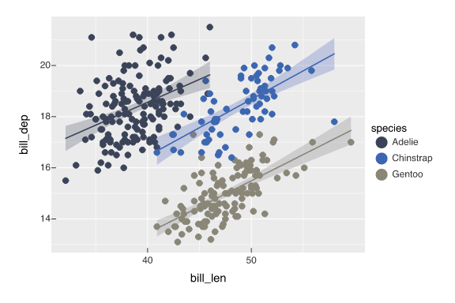
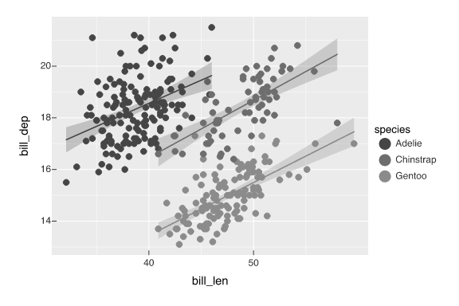
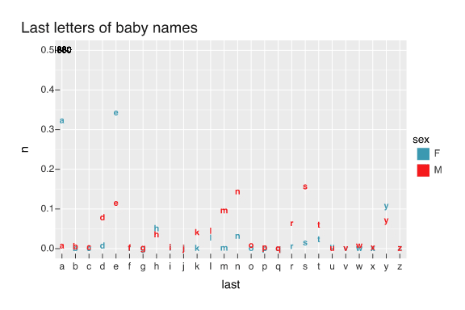

I recently came across `{vellumplot}` & `{vellumwidget}`, and while the details of what's going on under the hood is a little over my head, a lot of their features are very interesting.

For setting up, I won't be loading the tidyverse because there are a *lot* of named function conflicts between `{vellumplot}` and `{ggplot2}`.

::: {.callout-note collapse="true"}
## Conflicts

```{r}
#| message: true
conflicted::conflict_scout(
  pkgs = c("ggplot2", "vellumplot")
)
```
:::

```{r}
library(vellumplot)
library(vellumwidget)
```

# First plots

I'll kick things off with a simple scatterplot with linear smoothers of the `penguins` dataset.

```{r}
penguins |> 
  vplot() |> 
  mark_point(
    x = bill_len,
    y = bill_dep,
    color = species
  ) |>
  mark_smooth(
    x = bill_len,
    y = bill_dep,
    color = species,
    method = "lm"
  ) -> peng_plot

peng_plot
```

Aesthetic mappings aren't inherited between layers, so they need to be re-defined for each next layer.
Interestingly, the default behavior within a quarto document is to directly embed it within the rendered file as an svg (i.e., not inside an `` tag).
If you right click on the figure, there won't be an "Open image in a new tab" option or anything.

## Theming

There are a bunch of familiar looking themes

```{r}
ls("package:vellumplot") |> 
  purrr::keep(
    ~stringr::str_detect(.x, "theme_")
  )
```

::: panel-tabset
```{r}
#| echo: false
#| results: asis

library(rlang)

ls("package:vellumplot") |> 
  purrr::keep(
    ~stringr::str_detect(.x, "theme_")
  ) ->
  themes

for (t in themes){
  pcall <- call2(
    t, !!!list(peng_plot)
  )
  cat(
    stringr::str_glue(
      "## `{t}()`"
    )
  )
  eval(pcall) |> 
    plot_svg() |> 
    cat()
}
```
:::

Unfortunately, it doesn't look like default rendering plays nice with with [the relatively new `renderings` option in quarto](/posts/2025/09/2025-09-11_ggplot-4-0-and-dark-mode/) that lets you define light-mode and dark-mode content.

```{r}
#| echo: fenced
#| rederings:
#|   - light
#|   - dark
peng_plot
peng_plot |> theme_cyberpunk()
```

You can get around this by adding `.light-content` and `.dark-content` classes to the code chunk though.

```{r}
#| echo: fenced
#| classes: ".light-content"
peng_plot
```

```{r}
#| echo: fenced
#| classes: ".dark-content"
peng_plot |> theme_cyberpunk()
```

### Customizing themes

The `{vellumplot}` docs on themes are a little thin on all of the possible parameters.
A lot of them seem to be named after the `ggplot2::theme()` options.\

```{r}
{
  peng_plot |> 
    theme_cyberpunk()
}@theme |> 
  names()
```

## Accessibility

There are a few pretty cool accessibility features built in to `{vellumplot}`.
When exporting as an svg, alt-text is automatically included.
You can preview the default alt-text with `plot_alt()`.

```{r}
peng_plot |> 
  plot_alt() |> 
  stringr::str_wrap() |> 
  cat()
```

The renderer from the underlying `{vellum}` engine also has color blindness simulation built in.

::: panel-tabset
## Protanopia

```{r}
vellum::render(
  peng_plot, 
  cvd = "protan",
  "images/protan.png"
)

```

{fig-align="center"}

## Deuteranopia

```{r}
vellum::render(
  peng_plot, 
  cvd = "deut",
  "images/deut.png"
)

```

{fig-align="center"}

## Tritanopia

```{r}
vellum::render(
  peng_plot, 
  cvd = "deut",
  "images/tritan.png"
)
```

{fig-align="center"}

## Achromatopsia

```{r}
vellum::render(
  peng_plot, 
  cvd = "achro",
  "images/achro.png"
)
```

{fig-align="center"}
:::

# Interactivity

There are a bunch of interactive options available between `{vellumplot}` and `{vellumwidget}`.

```{r}
peng_ind <- penguins |> 
  dplyr::mutate(
    individual = dplyr::row_number()
  ) 

peng_ind |> 
  dplyr::mutate(
    label = stringr::str_glue(
      "<b>{island}</b> {year}"
    )
  ) |> 
  vplot() |> 
  mark_point(
    x = bill_len,
    y = bill_dep,
    color = species,
    tooltip = label,
    data_id = individual
  ) |> 
  as_widget()
```

I think the interactive legends that let you filter data are pretty cool.

```{r}
peng_ind |> 
  vplot() |> 
  mark_point(
    x = bill_len,
    y = bill_dep,
    color = body_mass,
    shape = island,
    data_id = individual
  ) |> 
  facet_wrap(
    ~species
  ) |> 
  as_widget()
```

# Animation

There's also animation features built in.

```{r}
library(babynames)

babynames |> 
  dplyr::mutate(
    last = stringr::str_extract(
      name, pattern = ".$"
    )
  ) |> 
  dplyr::count(
    year, sex, last,
    wt = prop
  ) |> 
  tidyr::complete(
    year, last, sex,
    fill = list(n = 0)
  ) ->
  last_letters

last_letters |> 
  vplot() |> 
  mark_text(
    x = last, y = n,
    color = sex,
    label = last,
    fontface = "bold"
  ) |> 
  mark_text(
    x = "a",
    y = 0.5,
    label = year
  ) |> 
  scale_color_discrete(
    palette = "Zissou 1"
  ) |> 
  labs(
    title = "Last letters of baby names"
  ) |> 
  transition_time(
    year
  ) |> 
  animate(nframes = 200) |> 
  anim_save(
    filename = "images/last.gif"
  )
```

{fig-align="center"}

# Extra Things

There are a few other interesting built-in things.

**Note**: For some reason, the plots, starting below, look funky in Chrome for me.

## Window function stats

```{r}
#| results: asis
last_letters |> 
  dplyr::filter(
    last == "n"
  ) |> 
  vplot() |> 
  mark_line(
    x = year, y = n,
    color = sex,
    window = list(op = "mean", k = 10),
    linetype = "solid"
  ) |> 
  scale_y_continuous(
    limits = c(0, 0.35)
  ) |>
  scale_color_discrete(
    palette = "Zissou 1"
  )
```

## Built in convex hulls

```{r}
#| results: asis
penguins |> 
  vplot() |> 
  mark_point(
    x = bill_len,
    y = bill_dep,
    color = species
  ) |>
  mark_hull(
    x = bill_len,
    y = bill_dep,
    color = species,
    fill = species,
    alpha = 0.5,
    expand = 0.1,
    blend = "multiply"
  ) |> 
  scale_color_discrete(
    palette = "Zissou 1"
  ) 
```

re

## Data shading

For a *lot* of overplotted data, there's a `mark_datashade()` to keep the size of svgs sensible

```{r}
data(flights, package = "nycflights13")
nrow(flights)
```

```{r}
#| results: asis
library(scales)
flights |> 
  vplot() |> 
  mark_datashade(
    x = hour + (minute/60),
    y = dep_delay/60
  ) |>
  mark_smooth(
    x = hour + (minute/60),
    y = dep_delay/60,
    color = "black"
  ) |> 
  scale_x_continuous(
    limits = c(5, 24)
  ) |> 
  scale_y_continuous(
    trans = transform_asinh()
  ) 
  
```

# The Upshot

I think I'll keep messing around with `{vellumplot}`, but I'm not sure that I'll switch over from my `{ggplot2}` workflow too quickly.
The shared function names specifically make incorporating it into my tidyverse workflows challenging.

::: {.callout-note collapse="true"}
##  Comments
:::
